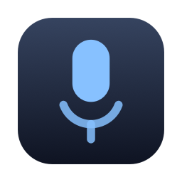
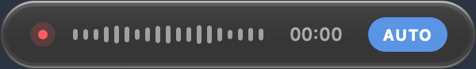

<div align="center">
  

  # LocalVoice

  **Free, fully local dictation for Apple Silicon Macs.**

  Tap a key, speak, and the text lands wherever your cursor is —
  transcribed by Whisper Large V3 Turbo, running entirely on your Mac.

  
  
  
  

  
</div>

## Why

Dictation apps like superwhisper or MacWhisper keep their larger, more accurate local models behind a paid tier. LocalVoice runs **Whisper Large V3 Turbo** — the same class of model — for free: fully open source, and after the one-time model download nothing ever leaves your Mac. Built on [ctrlSPEAK](https://github.com/patelnav/ctrlspeak), with a native frosted-glass pill UI, a guided installer, automatic DE/EN detection, and a configurable hotkey.

## Install

```bash
git clone https://github.com/Schereo/localvoice.git
cd localvoice
./install.sh
```

Needs an Apple Silicon Mac, [Homebrew](https://brew.sh), Xcode Command Line Tools, and ~3 GB of disk. The installer builds everything, walks you through the three macOS permissions (the prompts pre-list the app — no path hunting), and starts the service. Details, options, and troubleshooting: **[docs/setup.md](docs/setup.md)**.

## Use

| Key | Action |
|---|---|
| Hotkey tap (default: triple-tap **Ctrl**) | Start recording / stop and insert |
| **Enter** / **Esc** while recording | Insert / discard |
| **Cmd+,** while recording | Open the settings in your text editor |
| Badge click (`DE` / `EN` / `AUTO`) | Cycle the language mode |

Everything is configured in one file, `~/.config/localvoice/config` — hotkey (`hotkey = cmd,2`), language, a compact pill without the language badge, mic standby. Edits apply within seconds, no restart needed: **[docs/configuration.md](docs/configuration.md)**. The mic opens only while you record (the indicator stays honest); optional standby mode gives instant starts. If nothing can take the text, it stays on the clipboard. More: **[docs/usage.md](docs/usage.md)**.

Uninstall cleanly with `./uninstall.sh`.

## More

- **[docs/setup.md](docs/setup.md)** — installer steps, permissions wizard, code signing, health checks, uninstall
- **[docs/configuration.md](docs/configuration.md)** — the config file: hotkey, language, compact pill, mic standby
- **[docs/usage.md](docs/usage.md)** — keys, language modes, insertion behaviour
- **[docs/how-it-works.md](docs/how-it-works.md)** — architecture: app identity, pill protocol, download pipeline, onset buffer
- **[docs/adding-a-language.md](docs/adding-a-language.md)** — how to add a third language beyond DE/EN
- **[CONTRIBUTING.md](CONTRIBUTING.md)** — project layout and how to hack on it

## Credits & license

Built on [ctrlSPEAK](https://github.com/patelnav/ctrlspeak) by Nav Patel (MIT), [MLX Whisper](https://github.com/ml-explore/mlx-examples) by Apple, and [Whisper Large V3 Turbo](https://huggingface.co/mlx-community/whisper-large-v3-turbo). MIT — see [LICENSE](LICENSE) and [NOTICE.md](NOTICE.md).
